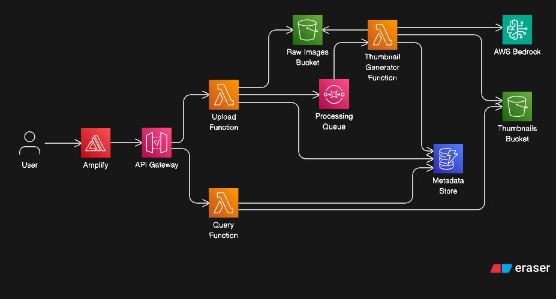

## Project Overview

**ThumbFlow** is a lightweight, fully serverless pipeline designed to streamline and automate the creation of image thumbnails at scale. Built entirely on AWS, it provides:

## Architecture
### Diagram

### Architecture Overview

ThumbFlow is built entirely on AWS using a serverless architecture. It processes uploaded images and generates resized thumbnails with minimal operational overhead and strong scalability.

#### Components

- **API Gateway**  
  Serves as the secure public entry point. Users upload images via a REST endpoint.

- **Lambda (Upload Handler)**  
  Receives file uploads, performs validation (e.g., file type/size), and stores original images in an S3 bucket.

- **Amazon S3 (Raw Bucket)**  
  Stores unprocessed (original) images. Triggers processing when new objects are uploaded.

- **Lambda (Thumbnail Generator)**  
  Triggered by S3 events. It reads original images, generates resized thumbnails, and stores them in the processed bucket.

- **Amazon S3 (Processed Bucket)**  
  Stores the generated thumbnails, organized by size or user.

- **Amazon DynamoDB**  
  Stores metadata about each uploaded image and its generated thumbnails, such as dimensions, storage paths, and processing status.

- **Amazon CloudFront**  
  Serves thumbnails from the processed S3 bucket via a global CDN with optional caching and custom domain support.

### Flow Summary

1. A client uploads an image via API Gateway → Upload Lambda.
2. The Lambda stores the image in the Raw S3 Bucket.
3. The Raw Bucket triggers the Thumbnail Generator Lambda.
4. The Lambda creates thumbnails and stores them in the Processed S3 Bucket.
5. Metadata is recorded in DynamoDB.
6. Thumbnails are served through CloudFront via a public endpoint.

## License

This project is licensed under the **Apache License 2.0**.

You are free to use, modify, and distribute this software, including for commercial purposes, under the terms of the Apache 2.0 License.

For full details,  visit the official license text: [https://www.apache.org/licenses/LICENSE-2.0](https://www.apache.org/licenses/LICENSE-2.0)